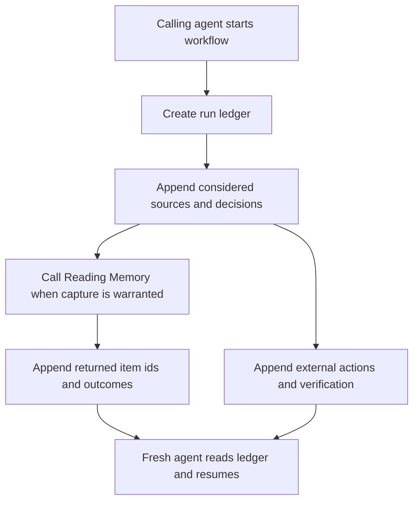

# Combine Harvester Run Ledger

## Summary

Add a file-backed run ledger for Reading Memory workflows so agents can resume newsletter triage without reconstructing state from chat. The plan keeps v1 outside the HTTP service while defining event semantics that can later move into service-backed run events.

---

## Problem Frame

Reading Memory persists durable corpus facts, but current reading workflows still lose operational context across compaction, handoff, or interruption. Newsletter triage is the first proof case: it spans fetched email state, read/skim/done decisions, archive/restore actions, Reading Memory ingests, and final verification.

The implementation should create a small, boring run-ledger convention that calling agents can use immediately. It should not add a new public API until real runs prove the event vocabulary.

---

## Requirements

**Ledger Convention**

- R1. Define a run directory containing a human-readable summary, machine-readable inputs, append-only events, and final outputs.
- R2. Support multi-step Reading Memory workflows without adding HTTP endpoints or SQLite migrations in v1.
- R3. Make the event vocabulary stable enough to cover newsletter triage first and morning brief assembly next.

**Newsletter Triage Proof**

- R4. Record each considered newsletter with lightweight source identity, decision, rationale, and action state.
- R5. Record archive, restore, and verification actions separately from reading decisions.
- R6. Record Reading Memory ingest results by item id when captures occur.
- R7. Avoid storing full rejected newsletter content by default.

**Resume And Verification**

- R8. A fresh agent must be able to inspect a run ledger and identify completed, pending, and verified work.
- R9. Tests must cover interrupted newsletter triage without touching real inbox state.
- R10. The pattern must leave a clear promotion path to service-backed run storage after real runs stabilize event names.

---

## Key Technical Decisions

- **File-backed v1:** Use local run artifacts first because the core product risk is resumability, not storage. This avoids API, migration, auth, and deployment surface until the event vocabulary has proof.
- **Helper script over hidden convention:** Ship a small script that creates/updates ledgers consistently. Relying only on prose instructions would recreate the drift this pattern is meant to avoid.
- **Append-only event stream:** Treat the event log as the source for replay/resume and the markdown summary as the readable status surface. This keeps human and machine needs separate.
- **Workflow-neutral event names:** Use names like `run_started`, `source_considered`, `decision_recorded`, `external_action_recorded`, `memory_capture_recorded`, `verification_recorded`, and `run_resumed` rather than Gmail-specific names.
- **No service-backed run events yet:** Do not modify `src/api/server.ts`, `src/api/contracts.ts`, `src/db/schema.sql`, or `src/db/migrations.ts` for v1 unless implementation proves file-backed ledgers cannot meet the resume requirement.

---

## High-Level Technical Design

The run ledger is a caller-side operational artifact that can reference Reading Memory corpus facts without becoming a corpus fact itself.

The design deliberately separates:

- run state: what the agent did and what remains
- corpus state: what Reading Memory stored and can recall
- external state: what happened in Gmail/Superhuman or another workflow surface

---

## Implementation Units

### U1. Define Run Ledger Format And Event Vocabulary

**Goal:** Establish the durable artifact shape and event names before adding helper code.

**Requirements:** R1, R3, R4, R5, R6, R7, R10

**Files:**

- Add: `docs/run-ledgers.md`
- Modify: `.agents/skills/use-reading-memory/SKILL.md`

**Approach:**

- Document the run directory shape:
  - `run.md` for readable status
  - `inputs.json` for source window and workflow inputs
  - `events.jsonl` for append-only state
  - `outputs.json` for final summary and verification
- Define a minimum event vocabulary:
  - `run_started`
  - `source_considered`
  - `decision_recorded`
  - `external_action_recorded`
  - `memory_capture_recorded`
  - `verification_recorded`
  - `run_resumed`
  - `run_completed`
- Define common event fields without overfitting to email: timestamp, workflow, source identity, decision, rationale, related item id, external action, verification status, and privacy posture.
- Update the bundled skill so agents know when to create a run ledger and how to resume from one.

**Test Scenarios:**

- Documentation gives a fresh agent enough information to create and resume a newsletter triage run.
- Event vocabulary can represent archive/restore actions without naming Gmail as the only external system.
- Event vocabulary can represent Reading Memory item captures without duplicating corpus analysis.

**Verification:**

- Manual doc inspection.
- `npm test`
- `npm run build`

### U2. Add Run Ledger Helper Script

**Goal:** Provide a small, repeatable caller-side tool for creating and appending run ledger artifacts.

**Requirements:** R1, R2, R4, R5, R6, R8

**Files:**

- Add: `scripts/run-ledger.mjs`
- Add: `scripts/lib/run-ledger.mjs`
- Add: `scripts/run-ledger.test.mjs`
- Modify: `package.json`

**Approach:**

- Add a script command that can:
  - create a run directory under a caller-provided root or the default Reading Memory data directory
  - initialize `run.md`, `inputs.json`, `events.jsonl`, and `outputs.json`
  - append a typed event as one JSONL row
  - render or refresh a compact readable status in `run.md`
- Keep the helper generic: it should know workflow names and event names, not Gmail internals.
- Add an npm script alias if the command is expected to be used directly by agents.
- Keep file writes atomic enough for normal single-agent use; multi-writer concurrency is out of scope for v1.

**Test Scenarios:**

- Creating a run produces all expected files with valid JSON where applicable.
- Appending events preserves existing rows and writes valid JSONL.
- Refreshing `run.md` reflects current phase, latest decision, pending step, and verification state.
- Script rejects unknown event kinds or malformed payloads with a clear error.
- Default output location can be overridden in tests so no real `~/.reading-api` state is touched.

**Verification:**

- `npm test`
- `npm run build`

### U3. Add Resume-Focused Test Fixtures

**Goal:** Prove a fresh agent can derive resume state from the ledger without live inbox or live Reading Memory mutation.

**Requirements:** R8, R9, R10

**Files:**

- Add: `scripts/fixtures/newsletter-triage-run.jsonl`
- Add: `scripts/run-ledger-resume.test.mjs`
- Modify: `docs/evals/reading-memory-trust.md`

**Approach:**

- Create a synthetic interrupted newsletter triage ledger:
  - fetched items recorded
  - some summarized decisions recorded
  - one Reading Memory capture recorded
  - archive actions not yet verified
- Add tests that parse the ledger and derive:
  - completed decisions
  - pending external actions
  - captured Reading Memory item ids
  - final next recovery step
- Document this as the first resume canary. It should complement `npm run eval:reading`, not replace corpus-quality evals.

**Test Scenarios:**

- Interrupted fixture identifies pending archive/verification actions.
- Completed fixture identifies no pending work and a final verification event.
- Capture rows are not treated as proof that external actions completed.
- Missing verification keeps the run in a resumable state rather than completed.

**Verification:**

- `npm test`
- `npm run build`

### U4. Integrate Newsletter Triage Guidance

**Goal:** Make the first proof workflow usable by agents during real newsletter cleanup.

**Requirements:** R4, R5, R6, R7, R8

**Files:**

- Modify: `.agents/skills/use-reading-memory/SKILL.md`
- Modify: `docs/run-ledgers.md`
- Modify: `README.md`

**Approach:**

- Add newsletter triage as the concrete first example for run ledgers.
- Specify what agents should record before and after archive/restore actions.
- Specify that low-signal or rejected newsletters should store lightweight identity and rationale, not full content.
- Document how to reference Reading Memory item ids returned by `/ingest`.
- Document final verification expectations: remaining queue, Done set, restored items, and captures.

**Test Scenarios:**

- A reader can follow the docs to understand when to create the ledger and what to append for read/skim/done decisions.
- Guidance distinguishes external actions from reading decisions.
- Guidance keeps rejected-content privacy limits explicit.

**Verification:**

- Manual doc inspection.
- `npm test`
- `npm run build`

### U5. Prepare Morning Brief Follow-Up Boundary

**Goal:** Make the second proof workflow clear without implementing it in v1.

**Requirements:** R3, R10

**Files:**

- Modify: `docs/run-ledgers.md`
- Modify: `docs/evals/reading-memory-trust.md`

**Approach:**

- Add a "next proof workflow" section describing how morning brief runs should eventually map onto the same ledger vocabulary.
- Explicitly state that `/brief-events` remains the resurfacing ledger and run ledgers only record operational assembly state.
- Capture promotion signals: after two or three real run ledgers, evaluate whether event names should move into SQLite/API-backed run events.

**Test Scenarios:**

- Documentation names morning brief as second proof workflow but does not require changing `/brief-guide` or `/brief-events`.
- Documentation makes the boundary between run events and brief events unambiguous.

**Verification:**

- Manual doc inspection.
- `npm test`
- `npm run build`

---

## Acceptance Examples

- AE1. Given an agent starts newsletter triage, when it creates a run ledger, then the ledger contains readable run status, input scope, append-only events, and empty outputs ready for final verification.
- AE2. Given the run is interrupted after summaries but before archive actions, when a fresh agent reads the ledger, then it can identify summarized items, captured Reading Memory item ids, pending external actions, and the next recovery step.
- AE3. Given an item is captured through `/ingest`, when the caller appends the capture event, then the ledger records the returned item id without copying the full analysis or source content.
- AE4. Given an archive action is performed, when verification has not yet been recorded, then the run remains resumable rather than completed.
- AE5. Given the pattern is later used for morning brief assembly, when an item is included in a brief, then the run ledger may reference the assembly decision while `/brief-events` remains the resurfacing source of truth.

---

## Scope Boundaries

- V1 does not add `POST /runs`, run-event tables, or new Reading Memory HTTP endpoints.
- V1 does not build an MCP adapter.
- V1 does not modify real newsletter archive scripts directly unless a later implementation step chooses to integrate caller-side usage outside this repo.
- V1 does not store full rejected newsletter content by default.
- V1 does not replace `/brief-events` or change `/brief-guide` behavior.

---

## Risks And Dependencies

- **Run ledger drift:** If agents hand-edit ledger files inconsistently, resume behavior weakens. The helper script and docs should reduce that risk.
- **Vocabulary overfit:** Newsletter triage has Gmail-specific details. Event names must describe source consideration and external action generally, while allowing Gmail IDs as optional metadata.
- **False confidence from docs alone:** The plan includes resume tests because documentation without a canary would not prove the combine-harvester pattern.
- **Adjacent observability work:** Consideration events and run ledgers overlap conceptually. V1 should keep run ledgers operational and file-backed; future service-backed events can reconcile the concepts after real usage.

---

## Sources And Research

- Origin requirements: `docs/brainstorms/2026-05-30-combine-harvester-run-ledger-requirements.md`
- Ideation source: `docs/ideation/2026-05-30-combine-harvester-reading-memory.md`
- Current service boundary: `ARCHITECTURE.md`
- Existing agent-facing skill: `.agents/skills/use-reading-memory/SKILL.md`
- Existing API surface: `src/api/server.ts`, `src/api/contracts.ts`
- Existing brief event implementation: `src/reading/brief-events.ts`
- Existing eval harness: `src/evals/reading-memory-eval.ts`, `src/evals/reading-memory-fixtures.ts`
- Existing package test/build commands: `package.json`
